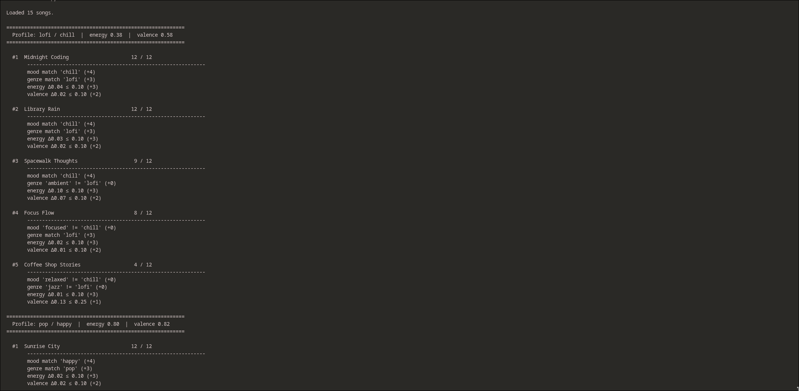
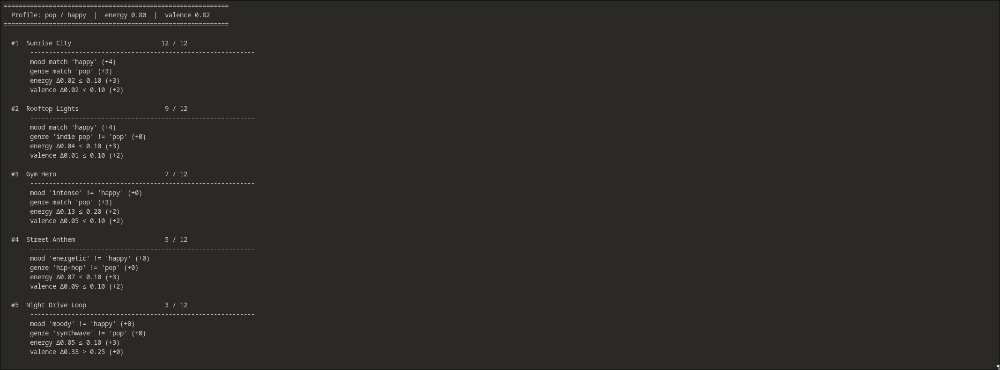

# 🎵 Music Recommender Simulation

## Project Summary

In this project you will build and explain a small music recommender system.

Your goal is to:

- Represent songs and a user "taste profile" as data
- Design a scoring rule that turns that data into recommendations
- Evaluate what your system gets right and wrong
- Reflect on how this mirrors real world AI recommenders

Replace this paragraph with your own summary of what your version does.

---

## How The System Works

- What features does each `Song` use in your system
  - `mood` — categorical, the emotional intent of the track (e.g. chill, happy, intense)
  - `genre` — categorical, broad stylistic grouping (e.g. lofi, rock, jazz)
  - `energy` — numeric 0–1, how intense or driving the track feels
  - `valence` — numeric 0–1, emotional positivity/negativity of the track

- What information does your `UserProfile` store
  - preferred `mood` and `genre` (categorical)
  - preferred `energy` and `valence` levels (numeric, 0–1)

- How does your `Recommender` compute a score for each song
  - categorical features (mood, genre): binary match — 1 if it matches the user's preference, 0 if not
  - numeric features (energy, valence): Gaussian proximity scoring — score is 1.0 at exact match and decays smoothly as the gap grows (σ = 0.20)
  - final score = weighted sum: mood (0.35) + genre (0.25) + energy (0.25) + valence (0.15)
  - mood and genre outweigh numerics because the same mood can be expressed across different energy levels

- How do you choose which songs to recommend
  - score every song in the catalog against the user profile
  - rank by final score descending
  - return the top N results


---

## Point Weighting Strategy

Each song is scored out of **12 points** against the user profile. The weights mirror the README's proportions (mood 35%, genre 25%, energy 25%, valence 15%) expressed as whole-number points.

| Feature | Match condition | Points |
|---------|----------------|--------|
| **Mood** (categorical) | exact string match | +4 |
| **Genre** (categorical) | exact string match | +3 |
| **Energy** (numeric) | \|song − target\| ≤ 0.10 | +3 |
| | \|song − target\| ≤ 0.20 | +2 |
| | \|song − target\| ≤ 0.35 | +1 |
| | \|song − target\| > 0.35 | +0 |
| **Valence** (numeric) | \|song − target\| ≤ 0.10 | +2 |
| | \|song − target\| ≤ 0.25 | +1 |
| | \|song − target\| > 0.25 | +0 |

The energy and valence tiers are sized around σ = 0.20 from the Gaussian formula — within one σ earns full numeric points, within two σ earns partial, beyond that earns nothing.

### Expected Biases

- **Categorical lock-in** — mood and genre together control 7 of 12 points. A song that is a near-perfect numeric fit but the wrong genre/mood can never outscore a genre+mood match, even a bad one. The system will always cluster around the user's stated labels.
- **Lofi/chill dominance** — the catalog has three lofi songs and two of them are tagged `chill`. Any profile that matches this pair will saturate the top two slots every time, leaving little room for variety.
- **Genre string fragility** — matching is exact. `"indie pop"` does not match `"pop"`, so closely related genres are treated as completely different. A user who likes pop may never see indie pop results.
- **Numeric proximity to "average" scores well** — songs with mid-range energy and valence (≈ 0.5) earn partial numeric points against almost any profile, which can lift stylistically irrelevant tracks above more fitting ones that happen to have extreme values.
- **Single fixed profile** — the system assumes one static taste at query time. A user whose mood shifts (study session vs. workout) gets the same recommendations regardless.

### Predicted Top 5 (profile: lofi / chill / energy 0.38 / valence 0.58)

| Rank | Song | Score | Why |
|------|------|-------|-----|
| 1 | Library Rain | 12/12 | genre + mood match, Δenergy 0.03, Δvalence 0.02 |
| 2 | Midnight Coding | 12/12 | genre + mood match, Δenergy 0.04, Δvalence 0.02 |
| 3 | Spacewalk Thoughts | 9/12 | mood match only, Δenergy 0.10, Δvalence 0.07 |
| 4 | Focus Flow | 8/12 | genre match only, Δenergy 0.02, Δvalence 0.01 |
| 5 | Coffee Shop Stories | 4/12 | no categorical match, Δenergy 0.01 (very close), Δvalence 0.13 |

---

## Data Flow

```mermaid
flowchart TD
    A["songs.csv\n15 rows · 10 columns"] -->|load_songs| B["Parse CSV\nEach row → Python dict"]
    B --> C["Select one Song dict\ne.g. Library Rain"]

    subgraph SCORE ["score_song(song, user_prefs)  ·  max 12 pts"]
        C --> D["Extract 4 features\ngenre · mood · energy · valence"]

        D --> E{"genre ==\nuser genre?"}
        E -->|yes| F["+3 pts"]
        E -->|no|  G["+0 pts"]

        F & G --> H{"mood ==\nuser mood?"}
        H -->|yes| I["+4 pts"]
        H -->|no|  J["+0 pts"]

        I & J --> K["Δenergy = |song.energy − target|"]
        K -->|"Δ ≤ 0.10"|         L["+3 pts"]
        K -->|"0.10 < Δ ≤ 0.20"| M["+2 pts"]
        K -->|"0.20 < Δ ≤ 0.35"| N["+1 pt"]
        K -->|"Δ > 0.35"|         O["+0 pts"]

        L & M & N & O --> P["Δvalence = |song.valence − target|"]
        P -->|"Δ ≤ 0.10"|         Q["+2 pts"]
        P -->|"0.10 < Δ ≤ 0.25"| R["+1 pt"]
        P -->|"Δ > 0.25"|         S["+0 pts"]

        Q & R & S --> T["Sum all points\n(0 – 12)"]
    end

    T --> U["Repeat for all\nremaining songs"]
    U --> V["Sort by score\ndescending"]
    V --> W["Return top N\n(song dict, score, explanation)"]
```

---

## Getting Started

### Setup

1. Create a virtual environment (optional but recommended):

   ```bash
   python -m venv .venv
   source .venv/bin/activate      # Mac or Linux
   .venv\Scripts\activate         # Windows

2. Install dependencies

```bash
pip install -r requirements.txt
```

3. Run the app:

```bash
python -m src.main
```

### Running Tests

Run the starter tests with:

```bash
pytest
```

You can add more tests in `tests/test_recommender.py`.

---

## Experiments You Tried

Use this section to document the experiments you ran. For example:

- What happened when you changed the weight on genre from 2.0 to 0.5
- What happened when you added tempo or valence to the score
- How did your system behave for different types of users

---

## Limitations and Risks

Summarize some limitations of your recommender.

Examples:

- It only works on a tiny catalog
- It does not understand lyrics or language
- It might over favor one genre or mood

You will go deeper on this in your model card.

---

## Reflection

Read and complete `model_card.md`:

[**Model Card**](model_card.md)

Write 1 to 2 paragraphs here about what you learned:

- about how recommenders turn data into predictions
- about where bias or unfairness could show up in systems like this


---

## 7. `model_card_template.md`

Combines reflection and model card framing from the Module 3 guidance. :contentReference[oaicite:2]{index=2}  

```markdown
# 🎧 Model Card - Music Recommender Simulation

## 1. Model Name

Give your recommender a name, for example:

> VibeFinder 1.0

---

## 2. Intended Use

- What is this system trying to do
- Who is it for

Example:

> This model suggests 3 to 5 songs from a small catalog based on a user's preferred genre, mood, and energy level. It is for classroom exploration only, not for real users.

---

## 3. How It Works (Short Explanation)

Describe your scoring logic in plain language.

- What features of each song does it consider
- What information about the user does it use
- How does it turn those into a number

Try to avoid code in this section, treat it like an explanation to a non programmer.

---

## 4. Data

Describe your dataset.

- How many songs are in `data/songs.csv`
- Did you add or remove any songs
- What kinds of genres or moods are represented
- Whose taste does this data mostly reflect

---

## 5. Strengths

Where does your recommender work well

You can think about:
- Situations where the top results "felt right"
- Particular user profiles it served well
- Simplicity or transparency benefits

---

## 6. Limitations and Bias

Where does your recommender struggle

Some prompts:
- Does it ignore some genres or moods
- Does it treat all users as if they have the same taste shape
- Is it biased toward high energy or one genre by default
- How could this be unfair if used in a real product

---

## 7. Evaluation

How did you check your system

Examples:
- You tried multiple user profiles and wrote down whether the results matched your expectations
- You compared your simulation to what a real app like Spotify or YouTube tends to recommend
- You wrote tests for your scoring logic

You do not need a numeric metric, but if you used one, explain what it measures.

---

## 8. Future Work

If you had more time, how would you improve this recommender

Examples:

- Add support for multiple users and "group vibe" recommendations
- Balance diversity of songs instead of always picking the closest match
- Use more features, like tempo ranges or lyric themes

---

## 9. Personal Reflection

A few sentences about what you learned:

- What surprised you about how your system behaved
- How did building this change how you think about real music recommenders
- Where do you think human judgment still matters, even if the model seems "smart"

### Screenshots


