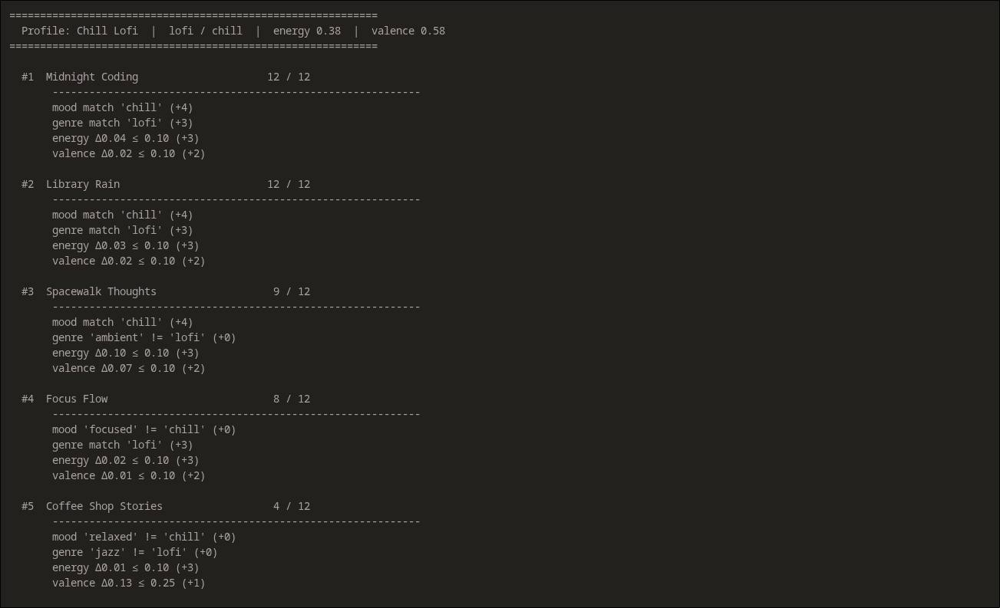
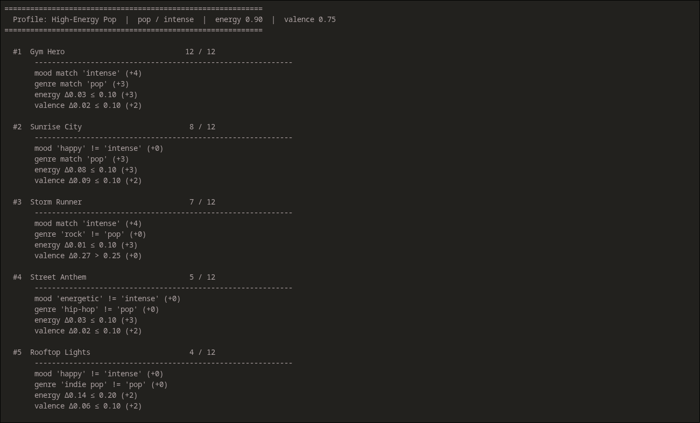
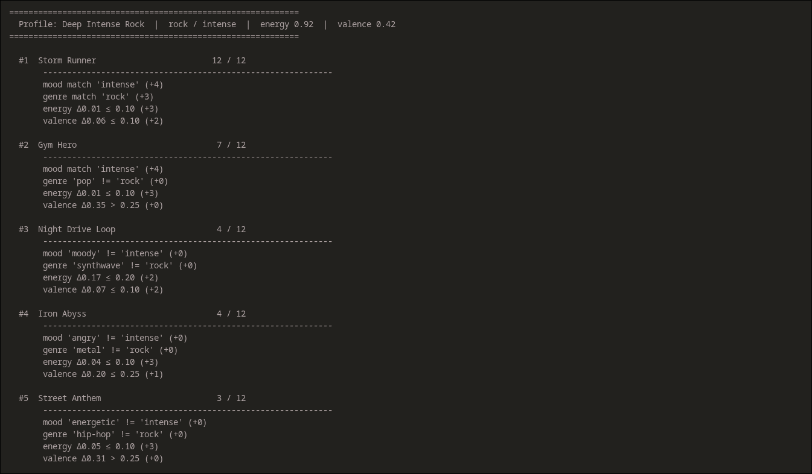
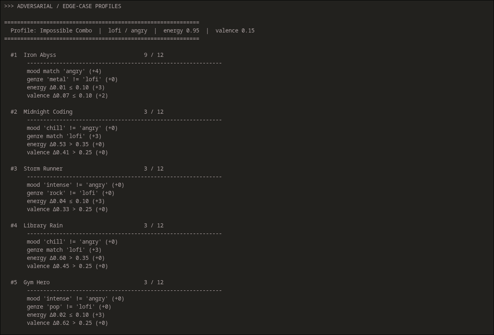
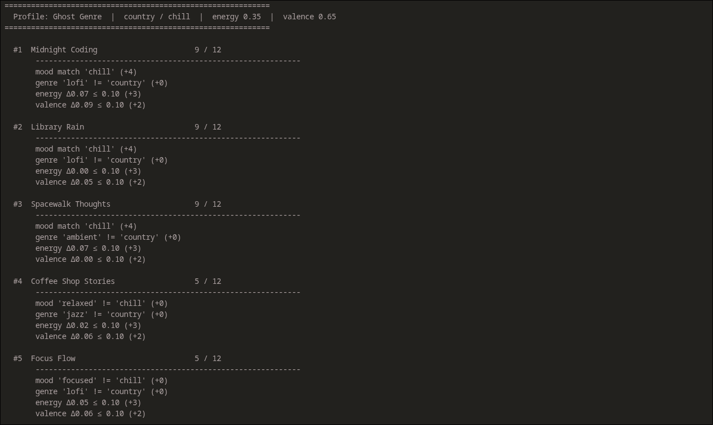
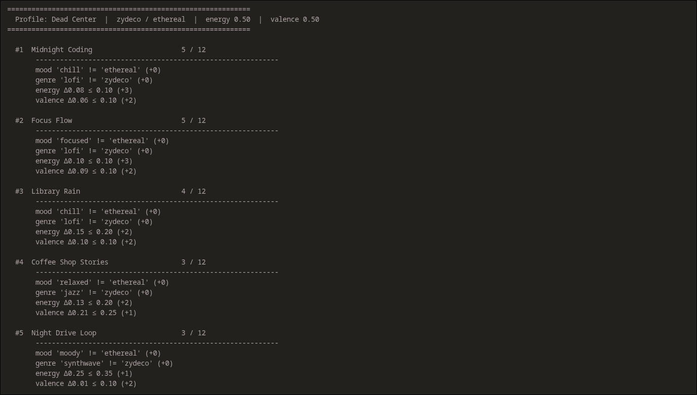

# 🎵 Mood Music

A RAG-powered music recommender that takes a free-text description of what you're in the mood for and returns personalized song recommendations — with explanations that reference actual song attributes like energy, tempo, mood, and acousticness.

---

## Original Project (Modules 1–3)

This project started as a rule-based music recommender called the **Music Recommender Simulation**. It scored each song in a 15-track catalog against a hard-coded user profile using a weighted point system (mood, genre, energy, and valence), then returned the top-scoring songs with a breakdown of why each was chosen. The original goal was to explore how real-world AI recommenders turn data into predictions — and to surface the biases and limitations that come with that approach.

---

## What Mood Music Does

In the upgraded version, you describe what you want in plain English — "something chill to study to" or "high-energy workout music" — and the system:

1. **Retrieves** the most relevant songs from the catalog using deterministic keyword scoring (no LLM involved here)
2. **Passes** those songs as context to Claude along with your original request
3. **Generates** a recommendation that actively reasons over the retrieved song data — citing specific attributes like energy level, BPM, acousticness, and mood — rather than producing a generic answer

Logging, guardrails, and tests ensure the system is reproducible and the AI stays grounded in the actual catalog.

---

## Architecture Overview

```
User query → Input Guardrail → Retrieval Engine (songs.csv)
                                       ↓
                              Context Builder (formats songs)
                                       ↓
                              Claude Sonnet 4.6 (LLM)
                              [query + retrieved songs as context]
                                       ↓
                              Output Guardrail (must cite a real song)
                                       ↓
                              Logger (rag_log.jsonl) → User
```

The retrieval layer scores songs against the query using mood/genre keyword maps and energy direction heuristics — fully deterministic and testable without any API calls. Claude only sees the top-k retrieved songs and must reason over their actual attributes.

See [`system_diagram.md`](system_diagram.md) for the full Mermaid diagram including testing and human review touchpoints.

---

## Setup

1. **Clone and enter the project**

   ```bash
   git clone <your-repo-url>
   cd ai110-module3show-musicrecommendersimulation-starter
   ```

2. **Install dependencies**

   ```bash
   pip install -r requirements.txt
   ```

3. **Add your API key**

   ```bash
   cp .env.example .env
   # Open .env and set: ANTHROPIC_API_KEY=your_key_here
   ```

4. **Run the web app** (recommended)

   ```bash
   streamlit run src/app.py
   ```

   Or use the terminal CLI instead:

   ```bash
   python src/main_rag.py
   ```

5. **Run tests** (no API key required)

   ```bash
   pytest
   ```

---

## Sample Interactions

**Query: "something mellow and chill"**
> Retrieved: Spacewalk Thoughts, Library Rain, Midnight Coding, Moonlit Sonata, Wandering Roads
>
> Here are a few mellow and chill picks from the list:
>
> **"Spacewalk Thoughts" by Orbit Bloom** — This ambient track is about as mellow as it gets, with a very low energy of 0.28 and a slow 60 BPM tempo. Its high acousticness (0.92) and chill mood make it perfect for unwinding, while a valence of 0.65 keeps it pleasantly warm rather than gloomy.
>
> **"Library Rain" by Paper Lanterns** — A classic lofi chill vibe with gentle energy (0.35), an easy 72 BPM tempo, and high acousticness (0.86). It strikes a nice balance — relaxed but with enough subtle groove (danceability 0.58) to keep things cozy rather than sleepy.
>
> **"Moonlit Sonata" by Aria Voss** — If you want to go even more serene, this peaceful classical piece has the lowest energy (0.15) and slowest tempo (52 BPM) of the bunch, with near-pure acousticness (0.98). Ideal for a deeply calm, mellow atmosphere.

---

**Query: "intense workout gym music"**
> Retrieved: Iron Abyss, Gym Hero, Street Anthem, Storm Runner, Night Drive Loop
>
> **"Iron Abyss" by Dreadmoor** — This metal track is built for intensity — maximum energy (0.96), a punishing 178 BPM tempo, and an angry mood that makes it ideal for pushing through a tough set. Its very low acousticness (0.02) means it's pure electric aggression with nothing soft to slow you down.
>
> **"Gym Hero" by Max Pulse** — Pop-fueled workout energy at 0.93, 132 BPM, with high danceability (0.88) and a bright valence (0.77) that keeps the vibe motivating rather than dark. Great if you want energy without the heaviness of metal.

---

**Query: "lofi beats to focus and study"**
> Retrieved: Midnight Coding, Library Rain, Focus Flow, Spacewalk Thoughts, Coffee Shop Stories
>
> **"Midnight Coding" by LoRoom** — Purpose-built for focus sessions: low energy (0.42), a steady 78 BPM, and high acousticness (0.71). The chill mood keeps distractions down while the lofi genre tag signals exactly the kind of background texture that supports concentration.
>
> **"Focus Flow" by LoRoom** — Tagged explicitly as "focused" mood with nearly identical specs: energy 0.40, 80 BPM, acousticness 0.78. If Midnight Coding feels slightly too laid-back, Focus Flow's slightly higher acousticness makes it even more ambient and study-friendly.

---

## Design Decisions

**Why RAG instead of just prompting Claude?**
Prompting Claude with "recommend me study music" would produce made-up song titles. RAG grounds the response in the actual catalog — Claude can only recommend songs it was given, and the output guardrail enforces this.

**Why keyword-based retrieval instead of embeddings?**
With 15 songs, vector embeddings would be over-engineering. The keyword approach is transparent, testable, and fully deterministic — the same query always returns the same candidates regardless of model or environment.

**Why split retrieval and generation?**
It separates concerns cleanly: retrieval is pure Python logic you can test without an API key; generation is the one place Claude is involved. This also makes debugging straightforward — if a recommendation is wrong, you can immediately see whether it was a retrieval failure or an LLM failure.

**Trade-offs**
- The keyword retrieval will miss queries that use synonyms not in the map (e.g. "tranquil" won't match "peaceful" unless added)
- The 15-song catalog limits variety — the system will frequently recommend the same top songs for similar queries
- Claude is prompted to stay within the retrieved list, which means a better-fitting song that scored 6th in retrieval won't appear even if it would have been the ideal pick

---

## Testing Summary

### Automated tests — 30/30 passing

| Suite | Tests | What it covers |
|---|---|---|
| `tests/test_recommender.py` | 2 | Original scoring logic |
| `tests/test_rag.py` | 28 | Full RAG pipeline (no API calls needed) |

The RAG tests cover four areas:
- **Input guardrail** — empty, whitespace, too-short, too-long, and boundary queries
- **Retrieval correctness** — chill queries surface lofi songs; workout queries surface high-energy songs; genre keywords match catalog genres
- **Retrieval consistency** — the same query run 5 times always returns identical results (determinism check)
- **Output guardrail + confidence scorer** — empty responses score 0.0; generic responses score below 0.3; responses that cite songs and reference attributes score above 0.5; more citations always raise the score

### AI reliability check — run against Claude

`python scripts/reliability_check.py` runs 6 predefined queries against Claude and measures each response on two dimensions: whether the output guardrail passes (response cites at least one real song) and a **confidence score** (0–1) that measures how actively Claude used the retrieved data — counting how many song titles and attributes like energy, tempo, and acousticness appear in the answer.

**Results from a real run against Claude Sonnet 4.6:**

| # | Query | Guardrail | Confidence |
|---|---|---|---|
| 1 | something chill to study to | ✓ PASS | 0.61 |
| 2 | intense workout gym music | ✓ PASS | 0.84 |
| 3 | romantic dinner jazz | ✓ PASS | 0.74 |
| 4 | angry aggressive heavy music | ✓ PASS | 0.68 |
| 5 | upbeat pop songs to dance to | ✓ PASS | 0.74 |
| 6 | music *(vague input)* | ✓ PASS | 0.68 |

**6 / 6 passed. Average confidence: 0.71.** Even the deliberately vague query "music" passed — Claude still cited real song titles from the retrieved list — though it scored lower than specific queries because the retrieval had no keyword signals to work with, returning a mixed bag of songs. The highest confidence (0.84) came from the workout query, where strong energy keywords produced a tightly focused retrieval and Claude referenced multiple attributes per song.

To reproduce: `python scripts/reliability_check.py` (requires `ANTHROPIC_API_KEY`). Results are saved to `reliability_report.json`.

### What I learned

Separating retrieval from generation made the system much easier to test — 28 of the 30 tests run with no API key at all. The confidence scorer revealed something the output guardrail alone couldn't: Claude was always technically "passing" (citing a song name) but the quality varied a lot depending on how specific the retrieval results were. That showed the retrieval layer is the real bottleneck, not the LLM.

---

## Reflection

Building Mood Music changed how I think about what "AI" actually means in a product. The most interesting part wasn't Claude — it was realizing that the retrieval layer (pure Python, no model) is what makes Claude's responses accurate and trustworthy. Without it, the LLM would hallucinate songs. With it, every recommendation is grounded in real data.

The guardrails taught me something too. The output guardrail — which just checks whether Claude mentioned a real song title — is simple enough to fit in three lines, but it catches a real failure mode. Thinking about *what could go wrong* and building a check for it felt more like engineering than just calling an API.

If I were to extend this, I'd want to add a feedback loop: let the user say "not quite, more upbeat" and have the system adjust the retrieval weights and re-query. That would make the RAG loop genuinely conversational rather than just one-shot.

---

## Model Card

[**View Model Card →**](model_card.md)

---

## Screenshots









