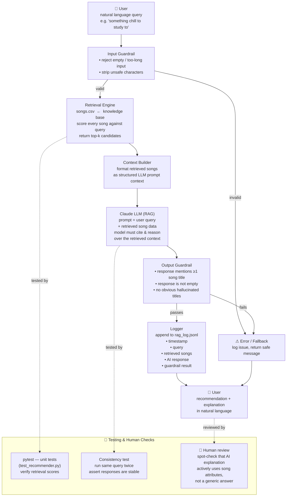

# Music Recommender — RAG System Diagram

### Screenshot

## Component Summary

| Component | Role |
|---|---|
| **Input Guardrail** | Reject bad queries before they reach the LLM |
| **Retrieval Engine** | Score `songs.csv` against the query; return top-k candidates |
| **Context Builder** | Format retrieved songs into a structured prompt block |
| **Claude LLM** | Generate a recommendation that *reasons over* the retrieved data |
| **Output Guardrail** | Verify the response cites real songs and is not empty/hallucinated |
| **Logger** | Write every request + response to `rag_log.jsonl` for audit/debug |

## Data Flow

1. User types a free-text query
2. Input guardrail validates it
3. Retrieval engine searches `songs.csv` and returns top-k scored songs
4. Context builder packages those songs into a prompt
5. Claude receives `[query + retrieved context]` and must reason over it
6. Output guardrail checks the response is grounded in real songs
7. Logger records everything; user sees the final recommendation

## Human & Testing Touchpoints

- **pytest** — unit-tests the retrieval scoring logic (deterministic, no LLM calls)
- **Consistency test** — runs the same query twice and checks the AI gives a stable answer
- **Human review** — spot-check that Claude's explanation references actual song attributes, not a boilerplate response
